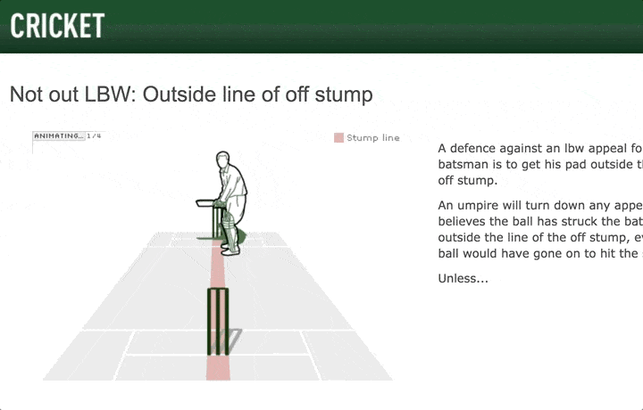
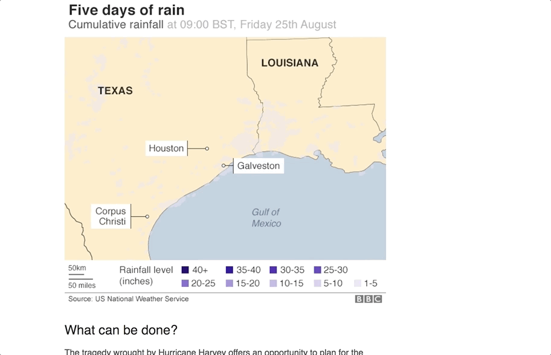
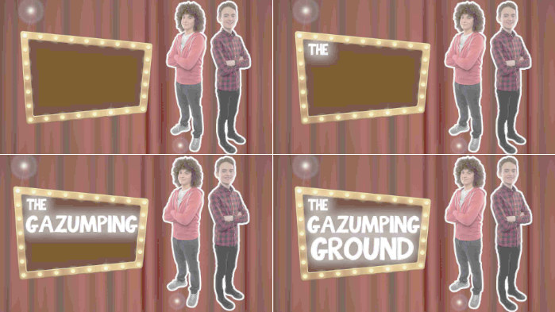
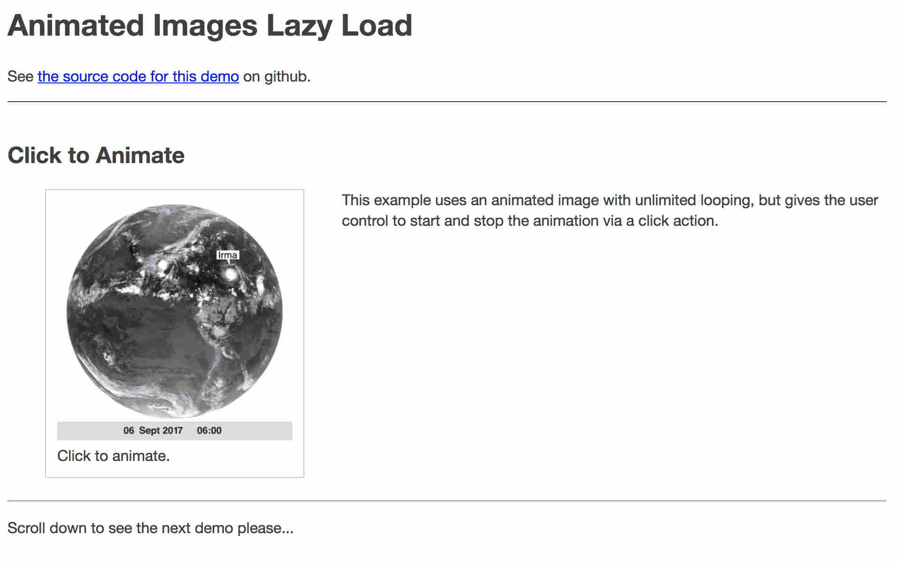

# Display Animated Images Accessibly

In this tutorial we focus on including animated images into a webpage in ways that are safe and accessible.

## Is This a Job for an Animated Image?

When considering the inclusion of any medium on a web page, a reasonable first question to ask is, "are there better alternatives?". Web content creators have a variety of formats available to choose from:

* Text
* Images
* Sound
* Video
* Interactivity

No single medium is perfectly suited to every content, but when thinking about motion and animation[^gel-motion] a video format and the [BBC's Standard Media Player (SMP)](http://cookbook.tools.bbc.co.uk) should definitely be on your short-list. The SMP is ideally suited to embed video in a web page, with support for a wide variety of file formats and an array of well-designed user controls, such as stop, rewind, replay etc. But is there a case where this full media player experience is too much whilst a plain old static image isn't quite enough?

### It's More Than an Image

Consider the case of an article describing the physics of a pendulum's swing. The concept is deeply intertwined with movement and timing. Using many paragraphs of text alone would be ineffective _but so would a mere static image_. A five second animation might be all that is needed to best capture and communicate the entire idea.

### It's Not Quite a Video

Carrying on with our example case of a five second animation showing a pendulum's swing, you should consider the use of a full Media Player as a possibility. The BBC's SMP is well-designed for video content, but if the animation is very short, does not include sound, and does not require sophisticated playback controls, it might be reasonable to decide that the full Media Player experience is overkill.

## Uses of Animated Images

There are many examples of animated images being put to good use around the BBC web site, both to convey information and to improve presentation.

### Animation to Convey Information

Animation is well-suited for explaining complex movement in sports.


Fig: BBC Sport illustrate the movement of a player in the game of cricket, demonstrating "Outside line of off stump", using an animated image.

Weather systems that change over time can be effectively illustrated using animation.


Fig: [BBC Weather](http://www.bbc.co.uk/news/world-us-canada-41107049) uses an animated image to show a growing storm on a hurricane-tracking map over the course of five days in Texas.

### Animation to Improve Presentation

Animation can also add a sense of excitement and fun to otherwise static images.


Fig: CBBC uses an animated image as the page header for their children's game show [The Gazumping Ground](https://www.bbc.co.uk/cbbc/joinin/the-gazumping-ground).

## Possible Pitfalls

Embedding animated images into a web page can add to the user experience, but there are limitations. Too much animation or images that flash or pulse repeatedly can be distracting and might even cause seizures in some. [^photo-epilepsy]

While the [animated <abbr title="Graphics Interchange Format">GIF</abbr> format](https://en.wikipedia.org/wiki/GIF#Animated_GIF) is widely popular due to the fact that it's simple to share and has broad support, it also brings several potential problems along with it:

* It supports relatively poor compression and therefore can result in a large file size.
* It requires relatively high levels of energy to render, so can use up batteries on mobile phones more quickly.
* It lacks any support for sound.
* It cannot natively be controlled, such as stopping or rewinding, by the user.

If your project requires an efficient file format, needs sound, or you want the ability to stop/start the animation, then formats other than GIF should be considered first.

### Still Here?

If you haven't been swayed to give up your idea of using animated images yet, it's time to consider how your content will be accessible and usable by _all_ of our BBC users.

## The Usual Rules Apply

Because animated images are still images, all the usual accessibility accommodations must still be applied for users with visual limitations. For example, as with any image, animated [images must have equivalent text available](http://www.bbc.co.uk/guidelines/futuremedia/accessibility/mobile/text-equivalents/alternatives-for-non-text-content) in order to convey the information in the image to non-sighted and visually impaired users, especially if the [image contains editorially significant text](http://www.bbc.co.uk/guidelines/futuremedia/accessibility/mobile/images/images-of-text).

## Blinking and Flashing

Along with all the considerations for images, animated images require additional care and caution due to their ability to blink or flash.

### Terms

Before proceeding further, it would be useful to review the relevant WCAG terminology around this issue[^wcag-flash], quoted below.

* **Blink**: switch back and forth between two visual states in a way that is meant to draw attention
* **Flash**: a pair of opposing changes in relative luminance that can cause seizures in some people if it is large enough and in the right frequency range

### Rate and Severity of Flashes

Flashing content should be treated with care because it has the potential to cause seizures in some people if it is large enough and in the right frequency range.

<blockquote>
<p>"Some people with seizure disorders can have a seizure triggered by flashing visual content. Most people are unaware that they have this disorder until it strikes. In 1997, a cartoon on television in Japan sent over 700 children to the hospital, including about 500 who had seizures."</p>
<footer>-- <cite><a href="https://www.w3.org/TR/UNDERSTANDING-WCAG20/seizure.html">WCAG Guideline 2.3: Do not design content in a way that is known to cause seizures.</a></cite></footer>
</blockquote>

To limit the chance of triggering seizures, the [WCAG guidelines](https://www.w3.org/TR/UNDERSTANDING-WCAG20/seizure-does-not-violate.html#seizure-does-not-violate-techniques-head) and [BBC guidelines](http://www.bbc.co.uk/guidelines/futuremedia/accessibility/mobile/design/flicker) advise that any flashing in an animated image be no faster than three times per second (unless the flashing area is small or of low contrast).

In practice, for an image to flash that quickly, it would have to essentially appear like a strobe. You might think it's unlikely your images would ever be _that_ obnoxious, but it can creep into an image inadvertently: for example a clip from a news story showing a celebrity walking the red carpet might include photographers firing camera flashes off in rapid succession.

### In the Real World: Web Browser Limits and Flashing

Be warned that if you are viewing an animated GIF in your favourite web browser, and the rate of flashing seems to be safely below the 'three times per second' advice, you may not necessarily be witnessing the same effect as other users. Why is this? The developers of web browsers must grapple with some hard limits of what their software can do. Specifically, if an animated GIF was created with an extremely high frame rate it is reasonable for the web browser to just give up trying to comply with such a high workload and to pick a more achievable frame rate of it's own. For example, some versions of Microsoft Internet Explorer are known to ignore frame rate settings that are faster than about 16 <abbr title="frames per second">FPS</abbr>[^frame-rate]. Other web browsers however may be able to manage the high frame rate. So just because it is playing slowly in your browser does not mean it will not play more quickly in others. Interrogate the image file itself and see what its actual setting values are to know what the _possible_ frame rate could be in any browser.

### A Warning About Warnings

To be safe, you might well consider avoiding flashing all together in an animated image, but if flashing is unavoidable and if you cannot reasonably minimise it, would a warning suffice to make it safe? If you've ever heard a television announcer say something like, "warning: the next segment contains some flashing images," you might think that a similar technique could be applied to web content. The WCAG guidelines[^wcag-flash] rightly point out that...

> Warnings do not work well because they are often missed, especially by children who may in fact not be able to read them.

A better approach would be to modify the image, either by slowing down the frame rate or toning down the severity of the flash, to be within safe limits.

## Looping and Looping and ...

Having an animation, no matter how subtle and attractive, constantly looping next to a passage of text for example, can be distracting for everyone. However, for users with reading or attention disabilities, a looping animation can make it difficult or even impossible to successfully read the text. The [WCAG guidelines](https://www.w3.org/TR/2008/REC-WCAG20-20081211/#time-limits-pause) includes a rule that addresses this:

> For any moving, blinking or scrolling information that (1) starts automatically, (2) lasts more than five seconds, and (3) is presented in parallel with other content, there is a mechanism for the user to pause, stop, or hide it...

Given an animated GIF image, there are several ways that we can address this. To start, time the total duration of the animation to see if it lasts longer than five seconds. If the animation is longer than that, especially if it loops infinitely, you should modify the image to limit the number of loops.

### Measuring Your Loops

The [WCAG guidelines](https://www.w3.org/TR/WCAG20-TECHS/G152.html) define the parameters to consider when calculating the duration of a looping animated image:

> The duration of the animation is the number of frames times the frame rate times the number of repetitions. For example, a simple blinking image with 2 frames, a frame rate of .5 seconds, and 3 repetitions will have a duration of (2 _times_ 0.5 _times_ 3) seconds, or exactly 3 seconds.

Trying to measure these parameters can be complicated, especially if you consider that the delay between frames in an animated GIF may not be consistent. Using a tool to measure these parameters can make the job _much_ easier.

If you don't already have a tool to measure looping in your GIF, you can use a tool like [GraphicsMagick](http://www.graphicsmagick.org/) (gm), released under the MIT License. As an example, the tool could be used to find the number of loops in an animated GIF with the following command:

```
gm identify -verbose example.gif | grep Iterations
Iterations: 0
```
Fig: Using a command line tool to find the number of loops in a GIF.

Notice that the number of iterations for the example image was set to be 0, which is equivalent to **unlimited** looping: clearly longer than our five second goal! To correct this we can adjust the number of looping cycles. If our goal is to make the total duration *5 seconds* or less, the formula is:

> `Loops = Math.floor( 5 / LoopDuration )`

In our case, with a loop duration of 2.2 seconds, we end up with a result of: `Loops = 2`.

### Modifying the Looping Duration of an Animated GIF

There are many tools that can be used to modify an animated GIF, but for this example we will carry on using the GraphicsMagick tool (gm).

```
gm convert -loop 2 example.gif example.twice.gif
```
Fig: Using a command line tool to set the number of loops in a GIF.

The resulting image, which was named "example.twice.gif", will only loop twice. If each loop duration is 2.2 seconds then we can expect the total animation to end after about four and a-half seconds, safely within our five second limit.

## Controlling Animated Images

The [animated GIF file format (GIF89a)](https://en.wikipedia.org/wiki/GIF#Animated_GIF) can result in relatively large files which, when downloaded, can cause noticeable performance problems. In addition, since GIF files don't natively support play/pause functions, if an animated image is near the bottom of a web page, the five second looping duration is likely to be finished before the user ever scrolls far enough to see it.

Both of these issues can be addressed via a technique called "lazy loading". In general this technique displays a relatively small placeholder image and then uses JavaScript to listen for a predefined event whereby the placeholder is swapped for a full animated image.

## Working Demo

Try a working demonstration of the techniques described in this tutorial (pictured below).


Fig: A demonstration of a recipe presented as a tabbed interface.

<a class="button" href="assets/example01.html">Go to the Demo.</a>

## Notes

[^gel-motion]: Using motion in design to communicate effectively is a topic that is well documented in the [GEL Guideline: _The ABCs of Motion_](http://www.bbc.co.uk/gel/articles/abcs-of-motion). You are strongly encouraged to study that guide before working with animated images.
[^photo-epilepsy]: See more about Photosensitive Epilepsy [at wikipedia](https://en.wikipedia.org/wiki/Photosensitive_epilepsy).
[^frame-rate]: For context, frame rate in animations like television cartoons, video games, and commercial release films can range from about 15 fps up to about 60 fps. See [Wikipedia: Frame rate](https://en.wikipedia.org/wiki/Frame_rate#Animation).
[^wcag-stop-pause]: "For any moving, blinking or scrolling information that (1) starts automatically, (2) lasts more than five seconds, and (3) is presented in parallel with other content, there is a mechanism for the user to pause, stop, or hide it unless the movement, blinking, or scrolling is part of an activity where it is essential" -- WCAG 2.2.2 "Pause, Stop, Hide"
[^wcag-flash]: "Web pages do not contain anything that flashes more than three times in any one second period, or the flash is below the general flash and red flash thresholds." -- WCAG 2.3.1 "Three Flashes or Below Threshold"
