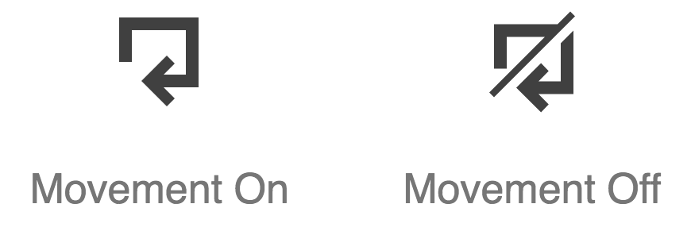

# Accessible iconography

The following is a set of accessibility best practices for working with [BBC icons](https://www.bbc.co.uk/gel/guidelines/iconography).

## When to use icons

Text is the primary form of communication on the web, and is highly interoperable. Only use icons where additional clarity is sought. Icons may help those with cognitive impairments, and others who find themselves on a page that isn't in their first language.

In most cases, icons should accompany text. Only where icons are extremely well-established—such as the play and stop buttons of a media player—is it reliable to use them without supplementary text.

## Creating icons

A [comprehensive and standardized set](http://bbc.github.io/gel-iconography/) of BBC icons is available. It is not recommended you create your own iconography. Cognition depends heavily on convention, and only by using established iconography can you foster familiarity.

## Avoid icon fonts

The [BBC icons](http://bbc.github.io/gel-iconography/) are intended for implementation using inline SVG. Like icon fonts, SVG icons are infinitely scalable without degradation.

Unlike SVG, icon fonts icons are mapped to unicode points and interpreted as text. This can have accessibility issues. Most icon font sets map their icons to the unicode [Private Use Areas](https://en.wikipedia.org/wiki/Private_Use_Areas) in order to avoid overriding established, meaningful characters and symbols. A problem occurs when users set their own fonts, using an extension or user stylesheet: the icons are replaced with 'missing character' symbols. Dyslexic users sometimes set their own fonts for improved legibility.

Icon font icons mapped to established characters are equally problematic. A close icon mapped to an 'A' would reveal itself as an 'A' when the font is overridden. Also, screen readers would interpret and announce the icon as 'A'.

## Labeling

All interactive controls need accessible labels, whether provided by text nodes or auxiliary attributes like `aria-labelledby`. Depending on how you incorporate icons into your controls, you need to choose an appropriate labeling method.

### Icon with text

In cases where both the icon and accompanying text are visible, ensure the text is within the control element. The following example is for a download link. Note that the icon must be to the left of the text.

```html
<a href="link/to/download" download>
  <svg>
    <use xlink:href="assets/svg/gel-icons-core-set.svg#gel-icon-download"></use>
  </svg>
  <span>Download</span>
</a>
```

Since the icon is not directly labeled, it will be ignored by assistive technologies and the calculated accessible name for the link will simply be _"Download"_. Do not provide alternative text / labels for icons where text is already available.

In the following incorrect example, the SVG takes the `img` role and an `aria-label` in order to be perceived as an `` with `alt` text. The repetitious output becomes _"link, download, download"_, _"link, graphic: download, download"_ or similar (depending on the assistive software in use).

```html
<!-- Avoid this -->
<a href="link/to/download" download>
  <svg role="img" aria-label="download">
    <use xlink:href="assets/svg/gel-icons-core-set.svg#gel-icon-download"></use>
  </svg>
  <span>Download</span>
</a>
```

### Standalone icon

Where only an icon is provided in the visual design, a supplementary invisible label is needed. The method from the previous section, using `role="img"` and `aria-label` is one method. However, `aria-label` is [not a string automatically translated by translation services](http://www.heydonworks.com/article/aria-label-is-a-xenophobe). Instead, hide the `<span>` visually, but leave it available to assistive technologies. Note `class="visually-hidden"` below:

```html
<a href="link/to/download" download>
  <svg>
    <use xlink:href="assets/svg/gel-icons-core-set.svg#gel-icon-download"></use>
  </svg>
  <span class="visually-hidden">Download</span>
</a>
```

The `visually-hidden` class is formed like this:

```css
.visually-hidden {
  clip-path: inset(100%);
  clip: rect(1px, 1px, 1px, 1px);
  height: 1px;
  overflow: hidden;
  position: absolute;
  white-space: nowrap;
  width: 1px;
}
```

#### Tooltips

If the icon has a [tooltip](https://en.wikipedia.org/wiki/Tooltip), the tooltip can act as the primary label.

In the following example, the `class="tooltip"` element provides the label.

```html
<a href="link/to/download" download>
  <svg>
    <use xlink:href="assets/svg/gel-icons-core-set.svg#gel-icon-download"></use>
  </svg>
  <span class="tooltip">Download</span>
</a>
```

By default, the tooltip would be hidden using `display: none`. It would be revealed on the `:hover` and `:focus` events.

```css
[download] .tooltip {
  display: none;
}

[download]:hover .tooltip,
[download]:focus .tooltip {
  display: block;
}
```

**Important:** [Do not rely on the `title` attribute](https://developer.paciellogroup.com/blog/2012/01/html5-accessibility-chops-title-attribute-use-and-abuse/) for your tooltips. These do not appear on focus, and are therefore not keyboard accessible.

If the tooltip element appears outside the control, associate it to the control element using `aria-labelledby`. In the following example, `aria-labelledby` and the tooltip's `id` share the value "download-tooltip".

```html
<div class="download-container">
  <a href="link/to/download" download aria-labelledby="download-tooltip">
    <svg>
      <use xlink:href="assets/svg/gel-icons-core-set.svg#gel-icon-download"></use>
    </svg>
  </a>
  <span class="tooltip" id="download-tooltip">Download</span>
</div>
```

## Focus

Icons used in controls would rarely need to be focusable themselves, because the (outer) control would receive focus instead. You should not, therefore, add `tabindex="0"` to icon SVGs.

Unfortunately, SVGs are focusable by default in Internet Explorer and some versions of Edge. To suppress focus in these browsers, you will need to add `focusable="false"` to the SVG itself.

```html
<a href="link/to/download" download>
  <svg focusable="false">
    <use xlink:href="assets/svg/gel-icons-core-set.svg#gel-icon-download"></use>
  </svg>
  <span class="visually-hidden">Download</span>
</a>
```

## Color

The usual [WCAG rules](https://www.w3.org/TR/UNDERSTANDING-WCAG20/visual-audio-contrast-contrast.html) for color contrast apply to icons, although the impact of icons with inadequate contrast is likely to be less critical than text. As with text, the larger the icon the more minimal the impact of low contrast. There is no good reason, however, to consider low contrast combinations under any circumstances.

### High Contrast Mode

In Windows High Contrast Mode, the text color is augmented to become very dark or very light. SVG icons are typically used alongside text like icon font icons. So that they adopt the same high contrast color of the text, use `currentColor`. For the BBC icons in the [demonstration page](http://bbc.github.io/gel-iconography/) this is already implemented. For reference, this is how it would be applied in CSS:

```css
svg {
  fill: currentColor;
}
```

Note that SVG uses `fill`, not `color`.

### Color independence

Controls often exist in changing states: active, disabled etc. It's important these states are not communicated in color alone, as outlined in [WCAG 1.4.1 Use of Color](https://www.w3.org/TR/WCAG20/#visual-audio-contrast-without-color). Otherwise they will not be perceivable to some color blind users, and others using non-color displays.

The movement icons get around this by using a diagonal line-through style for the "off" state (pictured).

.
