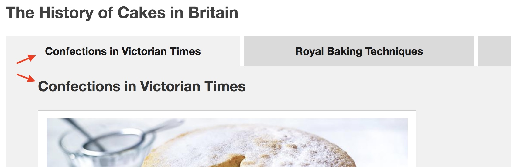

# An Accessible Tabbed Interface

A tabbed interface is a good way of grouping a series of content items into a single compact and familiar widget, but getting all the accessibility details right can be tricky. In this tutorial we will use BBC [GEL](http://www.bbc.co.uk/gel/guidelines/tabs) and Mobile Accessibility Guidelines as well as ARIA and HTML Web Standards to complete a fully working example.

## Semantic Foundations

As always, it's crucial that we start with a sensible and appropriate document outline[^document-outline]. In our example, we aim to structure our content like the following outline:

<ol>
    <li>A Heading</li>
    <ol>
        <li>Section One</li>
        <li>Section Two</li>
    </ol>
</ol>

Aiming for the outline shown above, we can start building our HTML foundation with just a few basic tags:

```html
<h1>A Heading</h1>

<section>
  <h2>Section One</h2>
  ...
</section>

<section>
  <h2>Section Two</h2>
  ...
</section>
```
Fig: The HTML foundation we will use to build a tabbed interface.

## Terminology

Before proceeding, let's first review the Web Standards names of the various parts we will be working with. The <abbr title="World Wide Web Consortium">W3C</abbr> <abbr title="Accessible Rich Internet Applications">WAI-ARIA</abbr> documentation [defines a Tabbed Interface](https://www.w3.org/TR/wai-aria-1.1/#tablist) with the following terms:

<dl>
  <dt>A Tablist</dt>
    <dd>"A list of tab elements."</dd>
  <dt>A Tab Element</dt>
    <dd>"A grouping label providing a mechanism for selecting the tab content that is to be rendered to the user."</dd>
  <dt>A Tabpanel Element</dt>
    <dd>"A container for the resources associated with a tab..."</dd>
</dl>

## Connections

To have a tabbed interface we need tabs, but what's the best markup to use? The [BBC GEL Guidelines for Tabs](http://www.bbc.co.uk/gel/guidelines/tabs#rules) points out that, "you can include a list of links before the content. This clarifies the content order and allows people to jump straight to what they want." This also provides us a handy place to hang our tab elements, so let's include the mark-up for that now:

```html
<article class="tabbed">
  <h1>A Heading</h1>
  
  <ul class="tablist">
    <li><a id="t1" href="#s1">One</a></li>
    <li><a id="t2" href="#s2">Two</a></li>
  </ul>

  <section id="s1" class="tabpanel">
    <h2>Section One</h2>
    ...
  </section>

  <section id="s2" class="tabpanel">
    <h2>Section Two</h2>
    ...
  </section>
</article>
```
Fig: Adding a list of in-page links to the related content sections.

Notice that we were careful to include unique `id` attributes to each of the `<a>` tab elements and to each of the `<section>` tabpanels. Doing this will allow us to connect the two elements up to each other using ARIA a bit later on.

## Hiding and Showing

Grouping content into tabs, versus merely displaying a series of headings and text blocks, can make that content more usable and accessible[^grouped-content]. By definition however this pattern requires us to show and hide content in response to user actions[^gel-tabs] and for that we must rely on enhancements via JavaScript and CSS.

The CSS we use will be based on the ARIA attribute that indicates hidden content, `aria-hidden="true"`. We can use that as a hook for an equivalent visual style:

```css
.tabpanel[aria-hidden="true"] {
  display: none;
}
```

 By manipulating the combination of attribute and style rule, we can effectively hide and show tabpanels such that only one is ever shown at a time. However, it is critical that the `aria-hidden` attribute is never hard-coded directly into the source HTML. The reason for this is that we will be relying on JavaScript to show each tabpanel as the user selects its tab element and we must _only hide content when it is possible for the user to reveal it again_.  

The solution, to avoid a scenario where a tabpanel is hidden via ARIA and CSS but the user has not enabled the JavaScript required to show it again, is to strictly use JavaScript to both _add and remove_ the `arria-hidden` attribute.

```javascript
var href = $(this).attr('href');
if ( this.isSelected ) {
    $(this).attr('aria-selected', 'true');
    $(href).removeAttr('aria-hidden');
} else {
    $(this).removeAttr('aria-selected');
    $(href).attr('aria-hidden', 'true');
}
```
Fig: Using JavaScript to toggle the state of the `aria-selected` and `aria-hidden` attributes.

## Adding ARIA

The [BBC Mobile Accessibility Guidelines](http://www.bbc.co.uk/guidelines/futuremedia/accessibility/mobile/structure/grouped-elements#HTML) show the ARIA tags used when content is being presented as tabbed, however it is important to keep in mind that only when JavaScript is functioning do the tabpanels actually become hidden or shown, so without JavaScript the tabbed interface semantics don't apply. For this reason we are only adding ARIA roles and attributes when JavaScript is functioning.

### Tablist ARIA

When our content is being presented as a tabbed interface, we are re-purposing an unordered list into a tablist. This is straightforward in ARIA: we simply add a `role="tablist"` attribute to the `<ul>`. However, once we do this, the `<li>` elements no longer make semantic sense, they belong to the `<ul>` but we just redefined the role of that element. So we now need to tell the web client that those `<li>` elements are no longer semantically list items. Again this is straightforward in ARIA: we add `role="presentation"`.

```javascript

$('.tablist').attr('role', 'tablist');
$('.tablist > li').attr('role', 'presentation');

```
Fig: Using JavaScript to add ARIA roles.

### Tab Element and Tabpanel ARIA

We're using the `<a>` elements in the tablist as our tab element. This gives us some out-of-the-box features: for example our tab elements can receive focus natively. We signal that these `<a>` elements are functioning as tabs by adding the attribute `role="tab"`. While we're at it, we can also define the ARIA relationship between the tab element and it's corresponding tabpanel via the ARIA attributes `aria-controls` and `aria-controlledby`.

 ```javascript
$('.tablist > li a').attr('role', 'tab');

$.each($('a[role="tab"]'), function() {
    var href = $(this).attr('href');
    $(this).attr('aria-controls', href.substr(1));
    $(href).attr('aria-controlledby', $(this).attr('id'));
});

 ```  
Fig: Using JavaScript to add ARIA attributes. 

## Focus Order

The order in which elements receive focus is illustrated below.

When a switch user moves focus through the Tabbed Interface without activating any of the Tab Elements, focus moves from the first Tab Element through each subsequent Tab Element to the last. If there are any focusable elements in the currently visible Tab Panel, that element should receive focus next, after the last Tab Element.


Fig: Focus moves from first tab element to last tab element, then to elements within the visible tabpanel.


## Keyboard Interaction

The [BBC GEL Guidelines for Tabs](http://www.bbc.co.uk/gel/guidelines/tabs) define the keyboard interactions for us:

* Use the tab key on your keyboard to access the tab labels.
* Use the return key to select the tab.
* On selection, keyboard focus is pushed to the heading within the tab panel.

Because we based our tab elements on native `<a>` elements, we get some of the above for free: for example we already have each tab element in focus order and links are "natively actionable" elements by default. The two tasks left for JavaScript are to toggle the selection state of each tab element when it receives a `click` event via mouse or keyboard[^keyboard-click], and to push focus to the heading within the tabpanel.

```javascript
$('a[role="tab"]')
.on('click', function(event) {
    setTabSelected( $(this) );
    
    // push focus to the tab panel
    var thisPanelLink = $(this).attr('href');
    $( thisPanelLink ).attr('tabindex', '-1')[0].focus();
    
    // stop page view from jumping when user clicks a tab element
    event.preventDefault();
});
```
Fig: Using JavaScript to manage focus when a tab element is selected.

While there are benefits to using the native `<a>` element as our tab element, it isn't a perfect fit: tabs are not _exactly_ links. One of the adaptations we have to make is to prevent the default behavior of the native `<a>` element in order to stop the browser from suddenly jumping it's view to the tabpanel content. Without this fix it could be disorienting to users of screen magnifiers to have the page unexpectedly move when they click what looks like a simple tab. So while treating a link as a tab we need to call the `event.preventDefault` method to stop the link from acting like a link. [^preventdefault]

## Working Demo

Try a working demonstration of the techniques described in this tutorial (pictured below).


Fig: A demonstration of a recipe presented as a tabbed interface.


<a class="button" href="assets/example01.html">Go to the Demo.</a>

## Additional Refinements

### Avoiding Visual Repetition

When we followed the guidance from BBC GEL to include a heading in each tab panel we made the outline of our content easier to understand for screen reader users and everyone without JavaScript but we may have introduced a new problem for sighted users with JavaScript: when the layout is arranged to display the tab elements along the top of the tab panels, there is a distracting repetition of the same heading text one on top of the other.


Fig: The text in the tab element is repeated in the tabpanel heading immediately below.

The GEL Guidelines provide an answer when it points out that the tabpanel "heading can visually hidden." By using CSS to position the tabpanel heading offscreen[^visuallyhidden] we acheive the compromise of having headings for each tab panel available to screen reader users but we don't distract sighted users by having the same text visually doubled-up at the top of the tab panel.

```html
<h2 class="visuallyhidden">Section One</h2>

``` 
Fig: Using a class name to indicate that a tabpanel heading should be visually hidden.

### Should We Move Focus?

Recall that we [added JavaScript to push focus to the tabpanel](#keyboard-interaction) element whenever that panel's label was selected. While this added behaviour is likely helpful to users who navigate by keyboard[^keyboard-users], it may be unexpected and distracting for others. To best accommodate everyone we can make our "push focus to the tabpanel" feature conditional so that it is not applied for users who are navigating via mouse and pointer as opposed to those who are navigating via keyboard.

```javascript
$('a[role="tab"]')
.on('mouseup', function(event) {
    $(this).prop('mouseclicked', true);
})
.on('click', function(event) {
    if ( !$(this).prop('mouseclicked') ) {
        var thisPanelLink = $(this).attr('href');
        $( thisPanelLink ).attr('tabindex', '-1')[0].focus();
    }
    $(this).removeProp('mouseclicked');

    // ... etc
});
```
Fig: Detecting when a tab has been selected via a mouse click versus a key press.

Note that the `click` event is fired for _both_ a mouse click as well as a focus and key press (typically the <kbd>return</kbd> or <kbd>enter</kbd> key), however only the mouse click fires a `mouseup` event.[^mouse-events]

## Notes

[^document-outline]: The [algorithm that calculates document outlines](https://www.smashingmagazine.com/2011/08/html5-and-the-document-outlining-algorithm/) is explained elsewhere on the web. Search for tools that can be used to display document outlines too.
[^grouped-content]: The Tabbed Interface component fulfills the advice regarding grouping, listed on [the BBC Mobile Accessibility Guidelines](http://www.bbc.co.uk/guidelines/futuremedia/accessibility/mobile/structure/grouped-elements): "Grouping elements into a single overall control makes things clearer, simplifies interactions and can provide larger touch targets."
[^gel-tabs]: "Only one content panel can be shown at a time." -- [GEL Guidelines: Tabs](http://www.bbc.co.uk/gel/guidelines/tabs#rules)
[^keyboard-click]: "The default action occurs when the user clicks the element with a mouse, but it also occurs when the user focuses the element and hits enter or space, and when the element is triggered via the accessibility API." -- [Techniques for WCAG 2.0, SCR35](https://www.w3.org/TR/2016/NOTE-WCAG20-TECHS-20161007/SCR35)
[^preventdefault]: Another option for preventing the link's default bahaviour is to `return false` from the event handler, but this will have the effect of stopping the event _propagation_ as well. So, if you expect that there may be any other handlers in the DOM that might want to react to this same `click` event (trackers for example) then it is safer to use `preventDefault`. See the [W3C specifications for UI Events](https://www.w3.org/TR/uievents/#event-flow-default-cancel) for more details.
[^visuallyhidden]: See [HTML5 Accessibility Chops: hidden and aria-hidden](https://developer.paciellogroup.com/blog/2012/05/html5-accessibility-chops-hidden-and-aria-hidden/).
[^keyboard-users]: This could include lots of users you may not initially have considered, for example users of web browsers embedded in television interfaces who are holding a TV remote or game controller with a D-pad. For more details about accessibility and focus outline, see [WCAG SC 2.4.7](https://www.w3.org/TR/UNDERSTANDING-WCAG20/navigation-mechanisms-focus-visible.html).
[^mouse-events]: "Click: Fires when a mousedown and mouseup event occur on the same element. Fires when the user activates the element that has the keyboard focus (usually by pressing Enter or the space bar)." -- [Quirksmode: click, mousedown, mouseup, dblclick](https://www.quirksmode.org/dom/events/click.html)
